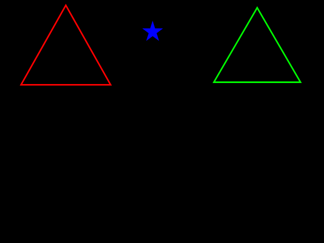
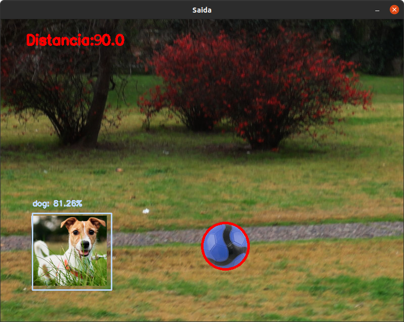

# Robótica Computacional 2023.1

## 1ª Simulado 

**Este simulado contém 3 questões de OpenCv.**

Nome:_______________

Questões que fez:____________

Observações de avaliações nesta disciplina:

* Inicie a prova no Blackboard para a ferramenta de Proctoring iniciar. Só finalize o Blackboard quando enviar a prova via Github classroom
* Durante esta prova vamos registrar somente a tela, não a câmera nem microfone
* Ponha o nome no enunciado da prova no Github
* Tenha os repositórios atualizados em seu catkin_ws/src .
* Você pode consultar a internet ou qualquer material, mas não pode se comunicar com pessoas ou colegas a respeito da prova
* Faça commits e pushes frequentes no seu repositório
* Avisos importantes serão dados na sala da prova
* Permite-se consultar qualquer material online ou próprio. Não se pode compartilhar informações com colegas durante a prova
* Faça commits frequentes. O primeiro a enviar alguma ideia será considerado autor original
* A responsabilidade por ter o *setup* funcionando é de cada estudante
* Questões de esclarecimento geral podem ser perguntadas
* É vedado colaborar ou pedir ajuda a colegas ou qualquer pessoa que conheça os assuntos avaliados nesta prova.

## Questão 1

Você precisa desenvolver um programa que identifica num vídeo onde estão as bandeiras do Japão e da Polônia. 

Regras:
* Seu programa precisa desenhar numa imagem um retângulo de borda sobre onde estiverem os dois países de interesse
* Seu programa precisa devolver as coordenadas dos cantos que contém a bandeira do Japão e a da Polônia, seguindo o modelo que está no `q1.py`

As imagens de entrada são deste tipo:

</img>

Os países a identificar serão: 

</img>

A ordem em que os cantos (corners) da *bounding box* de cada país devem ser retornados é esta. Sempre Japão primeiro e depois Polônia. Basta seguir a sequência indicada no código em `q2.py`. 
     
</img>

Você vai trabalhar no vídeo `bandeiras_paises.mp4` que já está no diretório. 

#### Orientações

Trabalhe no arquivo `q1/q1.py`. Este exercício **não precisa** de ROS. Portanto pode ser feito até em Mac ou Windows

|Resultado| Conceito| 
|---|---|
| Não executa | zero |
| Segmenta ou filtra a imagem baseado em cores ou canais da imagem e produz output visual| 1.0|
| Encontra contornos, com output visual| 1.5|
| Identifica um dos países corretamente com output visual e corners corretos | 2.2|
|Identifica o outro corretamente com output visual claro e corners corretos | 2.9 |
| Resultados perfeitos | 3.33|

Casos intermediários ou omissos da rubrica serão decididos pelo professor.

## Questão 2

Você deve fazer um programa que, a cada momento, indica se a estrela azul está dentro ou fora do seu triângulo designado.

#### O que você deve fazer:

Se o penúltimo dígito de seu RA for ímpar, você deve considerar o triângulo vermelho

Se o penúltimo dígito seu RA for par, você deve considerar o triângulo verde'

#### Orientações

A função `triutil.point_in_triangle()` é fornecida pronta e verifica se um ponto está contido num triângulo ou não. Analise e execute o programa `tritest.py` para saber como ela funciona

Você vai notar que este programa roda o vídeo `triangulos.mp4`. 

Trabalhe no arquivo `q2/q2.py`. Este exercício **não precisa** de ROS

#### O que você deve fazer:

Mostrar na tela a string "Dentro" sempre que a estrela estiver dentro de seu triângulo designado.

Mostrar na tela a string "Fora" se a estrela estiver fora. 

Caso a estrela esteja na borda do triângulo, e parte esteja fora e outra parte esteja dentro,  você pode dar qualquer um dos dois resultados. 

Note que você vai precisar **descobrir** quais são os vértices do triângulo para poder chamar a função `triutil.point_in_triangle()`.  
 
Você também vai precisar selecionar um ou mais pontos para resumirem a estrela. Por exemplo, o centro de massa ou o centro do contorno. Pode ainda usar todos os pontos que pertencem à estrela e tentar achar um consenso. Enfim, fica a seu critério.

|Resultado| Conceito| 
|---|---|
| Não executa | 0 |
| Segmenta e limiariza seu triângulo | 0.75|
| Encontra vértices do triângulo  | 1.5 |
| Consegue segmentar a estrela e calcular que pontos testar| 2.3 |
| Imprime sempre corretamente  | 3.33 | 

Casos intermediários ou omissos da rubrica serão decididos pelo professor.

## Questão 3

Você faz parte do projeto de uma plataforma digital para assistência a treinamento de cães, que tem o objetivo de fazer o pet se movimentar. Seu papel é fazer a parte da visão computacional que irá identificar se o cão está de fato fazendo o exercício pretendido e medir o seu aproveitamento.

Para tanto, seu programa deverá identificar se o cachorro se aproximou ou se afastou da bola entre dois frames consecutivos. No caso do cão se afastar da bola, uma mensagem adicional deve aperecer na imagem E no terminal: `REX, CORRE!`

#### Orientações

Trabalhe no arquivo `q3/q3.py`. Este exercício **não precisa** de ROS. Portanto pode ser feito até em Mac ou Windows

Você vai notar que este programa roda o vídeo `dogtraining.mp4`. Baixe o vídeo [neste endereço](https://drive.google.com/file/d/10v0lrUtciTE7HNeO2WSE4ug9HafpQvHP/view?usp=sharing), dentro da pasta `q23/`.

#### O que você deve fazer:

|Resultado| Conceito| 
|---|---|
| Não executa | zero |
| Identifica o cachorro OU a bola, marcando claramente na imagem | 1.0|
| Identifica o cachorro E a bola, marcando claramente na imagem  | 1.5|
| Identifica o cachorro e a bola e mede a distância entre os dois| 2.0 |
| Identifica que o cachorro se aproxima ou se afasta da boal     | 2.5 |

Casos intermediários ou omissos da rubrica serão decididos pelo professor.

*Exemplo do que deve ser feito*

Exemplo de imagem de entrada

Exemplo de imagem de saida

